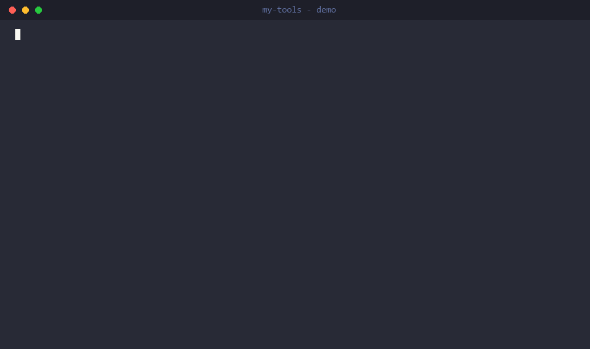
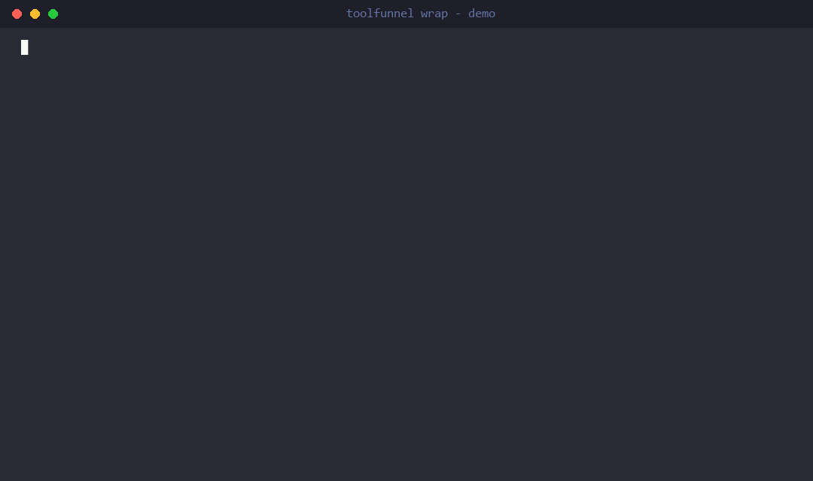

# ToolFunnel


> A zero-dependency MCP and Local tool gateway: host your own tools in any language, forward and curate tools from other MCP servers, expose them leanly to cut agent token cost, gate every call through your own policy hooks before it runs, create your own MCP servers easily with zero code - and **wrap any MCP server so it speaks both protocol eras, invisibly**.

**Zero code, zero dependencies: your own MCP server in 60 seconds** - from three ordinary scripts to a named, packaged, policy-gated MCP server (everything on screen is real output; see [demo/](demo/)):



**📖 Full documentation: [the ToolFunnel User Manual](docs/MANUAL.pdf)** - installation, the web UI, writing tools, attaching MCP servers, the policy gate, packaging, and troubleshooting, all illustrated with screenshots and worked examples. This README is the overview; the manual is the reference.

## The problem

Toolfunnel is designed to solve multiple issues in one package :)

The Model Context Protocol (MCP) lets an AI agent call tools from many servers. But every connected server dumps **all** of its tool schemas into the model's context on every turn. Connect a handful of rich MCP servers and you've spent thousands of tokens describing tools the agent won't use this turn - slower, costlier, noisier.

Similarly, working with AI I found myself generating many many tools, some of which I wanted to use with different AI workflows, some I didnt, and I didnt want to keep setting them up, I also didnt wish to keep many different setups for different workflows. Therefore ToolFunnel was born so that all of my multi-use tools and common MCP servers can be in one place, with any workflow, and I can easily select which I want to use with whatever workflow and even change or add tools during a session with simple toggles in the UI. You can also wanted to wire up and test MCPs *live*, in the running session, without resetting the CLI or restarting anything - and have its tools show up in the tools list straight away; ToolFunnel does exactly that.

Often also, there's also no consistent way to **govern** what an agent may run: hooks and policies live in the *host* (a specific CLI or otherwise), so they don't travel when you switch clients - with ToolFunnel, this is easy because your hooks travel with the tools - it can become your one swiss-army knife for many different workflows.

Additionally, I wanted an easy and consistent way to package my own tools and create new MCP servers from other tools, whatever language they were written in. FastMCP could do that, but not everything is written in python. I also  didnt want to audit huge numbers of dependencies - a personal choice, yes - so I wanted something that could be audited quickly and easily.

Finally, when the MCP chenges were announced as breaking changes, it became apparent this would eventually break a lot of MCP servers and/or clients out there, many of which might not be actively maintained. Not only that but changing MCP protocol generations takes time and might take considerable effort depending on the complexity of the server - therefore I added a quick, simple single command tool that allows ToolFunnel to wrap and MCP and easily translate between new and legacy protocols - quick, low effort, maximum gain.

At the time of writing, I have 14 MCP tools and 98 local tools all accessed through toolfunnel, gated as required.

## What ToolFunnel does

ToolFunnel is one small MCP server that sits between your agent and everything else:

1. **Hosts your own tools** - define first-party tools in a JSON register and serve them directly. Seven demo tools ship in the box.
2. **Forwards other MCP servers - leanly.** Attach an upstream MCP and its tools appear in the same lean register as your own, runnable through the gate. Curate which appear, promote a chosen few to top-level "every-turn" tools, or leave them lean by default.
3. **Lean register** - the agent sees short tool *briefs*; the full instructions for a tool are fetched on demand, so context stays small. *(This is the token saver.)*
4. **Server-side policy gate** - every server-side execution path fires your PreToolUse / PostToolUse hooks inside the gateway, so your policy works on any client, not just hosts that support hooks. The gate travels with the gateway, and fails closed.
5. **Configure by file, UI, or in-band** - plain JSON files, an optional loopback web UI, or ten in-band management functions (`tf_*`) all add / curate / toggle tools, upstreams, and hooks - live, no restart - and package the whole setup for deployment.
6. **Audit when you want it** - a toggleable JSONL log (default off) records tool runs, every gate allow/deny decision, and every upstream connect / disconnect / reconnect.
7. **Live & self-healing** - attach/curate/toggle on a running gateway with no restart; if an attached MCP's process dies, the gateway detects it and reconnects in the background with backoff.
8. **Build your own MCP server, no code, no SDK** - assemble scripts and curated upstream tools, switch the meta-tools off, and ToolFunnel *is* your MCP server; `tf_pack` ships it as a `npx`-installable npm package.
9. **Wrap any MCP server** - one command turns ToolFunnel into a transparent, dual-era wrapper for a single MCP server: modern clients can use legacy servers, legacy clients can use modern servers, and neither side can tell ToolFunnel is there. *(The headline of 0.6.0 - see below.)*

## Under the hood

Three claims in this README carry the most weight, and each one has a proof you can run:

- **The gate fails closed.** A PreToolUse deny means the tool's execute path is never entered. The test suite proves it directly: a tool plants a side-effect file, the gate denies the call, and the test asserts the file never appears.
- **The wrap is tested at the wire, against servers we didn't write.** Elicitation bridging, cancel translation into the upstream's own request ids, identity mirroring and subscription replay all run over real pipes in the suite, including integration tests against the official MCP SDK client and a real npx-launched third-party server.
- **The suite runs on 3 operating systems.** CI covers Linux, macOS and Windows across Node 18, 20 and 22 (35 test files). `npm test` runs the same suite locally.

The reasoning behind the bigger design decisions (why no SDK, why fail-closed, why zero dependencies, where the isolation boundary sits) is in [docs/design.md](docs/design.md).

## Wrap any MCP server - one command, both protocol eras, invisible

The 2026-07-28 MCP revision is a **breaking** protocol change: it removes the `initialize` handshake and sessions that every earlier server and client is built on. When clients upgrade, unmaintained legacy servers stop working with them; older clients can't talk to new-style servers at all. A lot of good tools are going to get stranded on the wrong side of that line.

`toolfunnel wrap <server>` un-strands them:

```
toolfunnel wrap my-old-server
```

Watch it happen (everything on screen is real output):



That's it - zero configuration. The name is an attached upstream's id (not attached yet? that's one `tf_mcp_add` call or UI row first). The command probes the server and tells you which protocol era(s) it speaks; if the server needs paths outside the gateway root (a filesystem server serving your documents folder, say) you get a clear security notice up front explaining exactly what that means. Changed your mind, or just looking?

```
toolfunnel wrap                       # show what's currently wrapped
toolfunnel wrap --off                 # undo - restore the normal ToolFunnel surface
toolfunnel wrap my-old-server --as legacy-tools   # present a name of your choosing
```

The wrap survives restarts, and the web UI has the same controls (Wrap / Unwrap on the MCPs tab). ToolFunnel becomes that server, for both eras at once:

- **Any client, any server, any combination.** Legacy client → modern server, modern client → legacy server, or matched pairs - all four combinations work through the same wrap. The gateway speaks both dialects natively and translates between them.
- **Invisible from both sides.** The client sees the wrapped server's own identity, tools, results, errors, and notifications - byte-for-byte, verified against real published servers. The server sees a normal client with your client's identity. No renamed tools, no injected prefixes, no "via toolfunnel" tells - the wrap presents the server *as itself*. Tool calls wait up to 120 s by default and a progress-reporting tool keeps its call alive indefinitely; for silent tools that run longer, set `"timeoutMs"` on the upstream in `expose.json`, and for a server that needs longer than 10 s to boot before it can answer its handshake, set `"requestTimeoutMs"` the same way.
- **The hard parts are bridged, not dropped.** Mid-call user prompts (elicitation) from a legacy server are translated into the modern retry pattern and back - for modern clients; a legacy client gets a clean decline rather than a hang (the bridge targets the era gap, and legacy-to-legacy relay is on the roadmap). Resource subscriptions survive - and are silently re-established if the wrapped server crashes and reconnects. Progress tokens flow through. Cancellations are translated into the server's own request ids.
- **Still governable when you want it.** Wrapping doesn't switch off the gate: every call can still pass your PreToolUse hooks, and every tool still has its visibility dials - hide a dangerous tool, and it vanishes from the wrapped surface too. Transparency is the default; the levers are opt-in.

Use it to keep a favourite unmaintained server alive past the cutover, to give a modern-only server to your older tooling, or just to put a policy gate in front of a server you didn't write - without its client ever knowing. One related dial: if an upstream should *stay* on the old protocol forever, set `legacyPin` on it (a toggle in the UI, or one field in `mcp/expose.json`) and the gateway will never auto-upgrade it - opt-in, and it warns loudly so nobody forgets it's there. Full details (including the security model for wrapped servers with filesystem access): the [manual](docs/MANUAL.pdf).

## Build your own MCP server - no code, no SDK

ToolFunnel is a no-code MCP builder. Point it at a few scripts (any language), curate a set of tools from other MCP servers, or mix both, then switch its own four meta-tools off - and what your agent connects to is a plain, top-level MCP server presenting exactly your chosen tools. No decorators, no framework, no `@tool` boilerplate, no Python. One `tf_pack` call turns it into a publishable npm package your users install with `npx your-mcp`.

That puts ToolFunnel head to head with a framework like FastMCP for the "I just want to stand up an MCP server" job, from the opposite direction:

- **FastMCP:** write Python, decorate your functions, ship a framework dependency.
- **ToolFunnel:** declare your tools in JSON (or let the AI author them for you), and you have a gated MCP server - assembled from scripts *and* other people's MCP servers - with zero runtime dependencies and a policy gate built in.

If you can write a script, you can ship an MCP. The full walkthrough is in the [manual](docs/MANUAL.pdf); the short version is `toolfunnel_howto({ topic: "create-tool" })` and `tf_pack`.

### The meta-tool surface

The model never sees your long tail of tools directly. It sees four fixed **meta-tools** - `toolfunnel_list_tools`, `toolfunnel_tool_instructions`, `toolfunnel_howto`, `toolfunnel_run_tool` - and reaches the real tools through them: list the briefs, read one tool's instructions on demand, then run it through the gate. Any curated upstream tools you expose are advertised alongside them and run through the same gate.

### The visibility matrix

Every tool - your own, a forwarded upstream tool, and the four meta-tools - has three independent visibility dials: **enabled** (lean-visible), **hot** (promoted to the every-turn `tools/list` surface, directly callable), and **hidden** (manager-list declutter). Toggles are live, no restart.

This is what lets ToolFunnel be a lean register and a conventional MCP at the same time: keep the long tail lean, promote the few tools you call constantly, or promote your chosen set and switch the meta-tools off to present a plain top-level MCP server (the no-code-MCP posture above). Two footguns the UI warns about: hiding the meta-tools removes the agent's ability to discover tools by name, and promoting many tools reintroduces the context bloat the lean register exists to avoid.

### The gate

Every server-side run path - your tools, the management functions, and every forwarded upstream call - funnels through one gate:

```
gatedRun({ engine, ctx, toolName, args, execute })
  → fire PreToolUse   (may BLOCK; fails CLOSED if the engine errors)
  → execute()         (ONLY if allowed)
  → fire PostToolUse  (advisory; cannot un-run the tool)
```

Hooks speak the Claude-Code hook protocol (event JSON on stdin, exit `2` to block), so an existing hook travels here unchanged. The load-bearing invariant, proven by test: a PreToolUse deny means `execute()` is never called. The shipped example hooks are **disabled by default** - enable one in `hooks/hooks.manifest.json` (or the UI's Hooks tab) to turn policy on. Writing hooks, matchers, and worked examples: [manual](docs/MANUAL.pdf).

## Why it's different

Hosting tools and proxying other MCP servers is a crowded space - but for my own use case, which is why I rolled my own solution, I wanted something different.

A quick feature comparison as of June 2026:

| Capability | ToolFunnel | FastMCP | mcpproxy-go | MetaMCP | mcp-anything |
|---|:--:|:--:|:--:|:--:|:--:|
| Config-declared polyglot tools (no SDK) | ✓ | ✗ (decorators) | partial (proxy only) | ✗ | ✓ |
| Lean server-side exposure (briefs + schema on demand) | ✓ | partial | ✓ | ✗ | ✗ |
| Server-side fail-closed policy gate (Pre/Post) | ✓ | ✓ | ✓ | ✓ | ✗ |
| Live attach / hot-reload, no restart | ✓ | ✗ | partial | partial | ✓ |
| Non-Docker self-healing reconnect | ✓ | ✗ | partial (Docker) | partial (circuit-breaker) | ✗ |
| Visibility **matrix** - lean default + per-tool promote-to-every-turn + hide | ✓ | ✗ | filter only | cherry-pick only | ✗ |
| Zero runtime dependencies\* | ✓ (Node, no SDK) | ✗ (framework) | ✓ (Go) | ✗ (Docker) | ✓ (Go) |
| Runtime dependencies (installed / bundled) | **0\*** | many | 40+ (bundled) | many | bundled (Go) |
| Config web UI | ✓ | ✗ | ✓ | ✓ | ✗ |
| Dual-era protocol (2026-07-28 + legacy), client & server side | ✓ | ✗ | ✗ | ✗ | ✗ |
| Transparent single-server wrap (invisible, era-bridging) | ✓ | ✗ | ✗ | ✗ | ✗ |

Beyond the dependency count, four capability choices set ToolFunnel apart from a pure proxy like mcpproxy-go:

1. **It HOSTS, not just proxies.** A proxy forwards tools from existing MCP servers. ToolFunnel also turns an arbitrary local command or script, any language, into a first-class gated MCP tool from one JSON entry, with no SDK and no pre-existing server.
2. **Reference mode.** A tool ToolFunnel only *describes*: `toolfunnel_run_tool` hands back the instructions and the connected AI performs the action in its own environment - and the handoff itself is gated (a PreToolUse deny withholds the instructions). Nothing executes server-side.
3. **A portable policy gate, not a content scanner.** The gate speaks the Claude-Code hook protocol (PreToolUse/PostToolUse, exit-2-to-block) inside the gateway, so an existing hook/policy travels to any client unchanged - an easily adaptable (to CODEX or whatever you are using) programmable policy that ports, rather than a built-in scanner.
4. **The visibility matrix.** Not on/off filtering: a lean default you can selectively promote to the every-turn surface, hide from the manager view, or collapse entirely (turn the meta-tools off and present your tools as a plain top-level MCP).

Underneath it all: a lean surface (briefs + instructions-on-demand) that keeps token cost flat as you add tools, a fail-closed gate on every server-side path, and zero runtime dependencies\* in a component that sits in a privileged position. The wedge is the whole package in one small, auditable server, not any single trick.

### State of development and honest limitations

ToolFunnel is a focused solo build. I've tested it thoroughly for my own use case, but it may still contain bugs outside of that - and there are features I've leaned on less than others. The OAuth 2.1 and Streamable-HTTP implementations in particular are recent, added in line with the latest MCP SDK capabilities, and haven't been tested as extensively, so your mileage may vary.

There are no Prometheus/OpenTelemetry metrics either - instead there's a toggleable JSONL audit log plus in-memory call counters on `/health`. I haven't needed full metrics for my own use; if it's something you'd want, let me know and I'll look at adding it.

If you find a bug - better still, a bug and a fix - or have an improvement, I'd genuinely like to hear from you. I'm keen to work with others on ToolFunnel :)

And because it's hand-rolled rather than built on the MCP SDK, I'll need to keep it in line with MCP itself as the spec evolves - the revisions land roughly quarterly, and I aim to track new capabilities as they're announced. Again: if you'd like to get involved, I'd love to hear from you :)

## Use cases

- **Tame context bloat.** Several rich MCP servers connected at once drown the agent's context in tool schemas it won't use this turn. Behind ToolFunnel the agent sees short briefs and loads a tool's full schema only when it actually reaches for it.
- **One toolbox, many workflows.** Keep all your multi-use tools and common MCP servers in one place and pick which to surface per workflow, instead of re-wiring a different setup for every client.
- **Govern what an agent may run, on any client.** Put a fail-closed PreToolUse policy in the gateway so it travels with your tools, even to clients that have no hook system of their own.
- **Turn a script into an MCP tool without building an MCP.** Have a useful CLI, a bash one-liner, or a script in any language? Declare it in a JSON entry and it's a gated MCP tool - no protocol code, no SDK.
- **Keep a legacy internal MCP working.** Front an ageing in-house MCP server with ToolFunnel and keep the workflows that depend on it running as the ecosystem moves on.
- **Add a tool mid-session.** Need a tool while you're working? Drop it in and it's live on the next turn, no restart.
- **Survive an upstream crash.** If an attached MCP server dies mid-session, ToolFunnel notices, reconnects it in the background with backoff, and re-advertises its tools. Most reconnect logic elsewhere is Docker-scoped; this isn't.

## Zero dependencies, on purpose

ToolFunnel has no runtime npm dependencies (`"dependencies": {}`) and does not use an MCP SDK - the JSON-RPC 2.0 wire protocol is hand-rolled on top of Node built-ins (`node:http`, `node:child_process`, `node:fs`, ...). Requires Node >= 18. `npm install toolfunnel` pulls zero packages.

> **\* The one asterisk: OAuth is opt-in.** Enabling OAuth 2.1 (off by default) adds exactly one dependency - [`jose`](https://www.npmjs.com/package/jose), which is itself zero-dependency, audited, and the same library the official MCP SDK uses. It is not a runtime dependency of the core: it appears only as a `devDependency` (for the OAuth test suite) and is installed on demand for users who turn auth on. So the default footprint is genuinely zero, and the most security-sensitive code in the project - token validation - is delegated to an audited library rather than hand-rolled.

This is a deliberate security decision, not minimalism for its own sake. ToolFunnel sits in a privileged position - it gates tool execution - which is exactly where you don't want an unaudited dependency tree. And `dependencies: {}` in npm is a stronger claim than a "single binary" elsewhere: a Go gateway that ships as one binary still statically links its dependency tree (mcpproxy-go's, for example, runs to 40+ direct deps - goja, esbuild, gRPC, an observability stack). That's dependency-bundled, not dependency-free. In a year of high-profile npm supply-chain compromises, a tool-execution gate with nothing transitive to audit is a defensible engineering stance - you audit your code, not forty supply chains. (It is not a silver bullet: a zero-dep posture shrinks the audit surface, it doesn't remove the burden of getting the hand-rolled wire + gate correct - which I have tried to do.)

## Authentication - optional OAuth 2.1

By default the gateway is loopback-only and unauthenticated - the right posture for a single operator on `localhost`. For a networked or multi-user deployment, ToolFunnel can act as an OAuth 2.1 resource server: it validates the bearer token on every request before any tool runs, through `jose` with a pinned algorithm allowlist, enforced issuer, and an enforced audience bound to this gateway's resource URI (the RFC 8707 confused-deputy defence). Auth is what unlocks a non-loopback bind: the HTTP host refuses to bind off-localhost unless OAuth is enabled. Setup, config fields, and discovery details: [manual](docs/MANUAL.pdf).

The OAuth client leg (Dynamic Client Registration, authorization-server-metadata discovery, step-up auth) and the 2026 spec hardening are planned, not yet shipped - the resource-server slice is the shipped, tested MVP.

## Teams and bespoke builds

One ToolFunnel instance serves one operator - a deliberate design ([why](docs/design.md)). A Team edition (per-user identity, audit trails, quotas) is on the roadmap if there is interest - and custom gateways built on ToolFunnel are available today. Open an issue titled `enquiry`.

## Quickstart

[](https://glama.ai/mcp/servers/Rendeverance/toolfunnel)

```bash
npm install toolfunnel        # runtime dependencies: none
# or from source:
git clone https://github.com/Rendeverance/toolfunnel.git && cd toolfunnel && npm install

node bin/toolfunnel.js        # stdio MCP server (what most clients spawn)
node bin/toolfunnel.js --ui   # optional config web UI on 127.0.0.1:9777
```

Point your client at it via `.mcp.json`:

```json
{ "mcpServers": { "toolfunnel": { "command": "node", "args": ["/path/to/toolfunnel/bin/toolfunnel.js"] } } }
```

**Or skip the config entirely - just ask your AI.** Point any MCP-aware client at ToolFunnel and say *"attach this tool server, expose these tools, and block anything destructive."* The AI reads ToolFunnel's own built-in instructions and wires it all up for you - upstreams, exposed tools, a PreToolUse safety gate, even wrapping a server - in plain language, no JSON editing. Every feature is documented from the inside (`toolfunnel_howto` covers creating tools, attaching MCPs, hooks, packaging, wrapping, and configuration), so a plain agent with no special prompt can drive the whole gateway. Prefer to click? The web UI does the same. No coding experience required :)

The HTTP host (`--http`), registering over HTTP, the web UI tabs, the audit log, configuration files, project layout, and the smoke test are all walked through step-by-step, with screenshots, in the [manual](docs/MANUAL.pdf).

## Identity & settings - one small file

Everything the gateway calls itself lives in `toolfunnel.json` at the config home - every field optional, an absent file is simply the default identity:

```json
{ "serverName": "my-mcp", "serverVersion": "1.0.0", "clientName": "my-client", "httpPort": 9998, "uiPort": 9777 }
```

`serverName`/`serverVersion` are what connected *clients* see in the handshake; `clientName`/`clientVersion` are what upstream *servers* see from the gateway. (Under a wrap on stdio you don't need any of it - the wrapped server is shown your real client's identity automatically.) The web UI's **Settings** tab edits the same file.

Prefer to configure everything by hand? The whole gateway is driven by a handful of plain JSON files - no code anywhere. The complete map (every file, every field, a worked five-file example) is one call away for your agent - `toolfunnel_howto({ topic: "configure" })` - and in the manual's configuration chapter for you.

## Packaging: ship your own MCP

Everything you build here - tools, curation, upstream selections, policy hooks, identity - lives in one folder (the config home), and one management call packages it:

- `tf_pack { format: "home" }` produces a portable setup: zip it, git it, or run it with `--config-dir`.
- `tf_pack { format: "npm", name: "my-mcp" }` produces a publishable npm package that depends on toolfunnel (never forks it), bundles your setup, and gives your users `npx my-mcp` - your server, your name in the handshake, your tools and schemas, your gate enforced on their machine regardless of client.

Full story: [docs/packaging.md](docs/packaging.md).

## License

[MIT](LICENSE)
